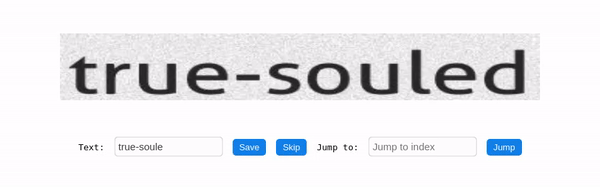
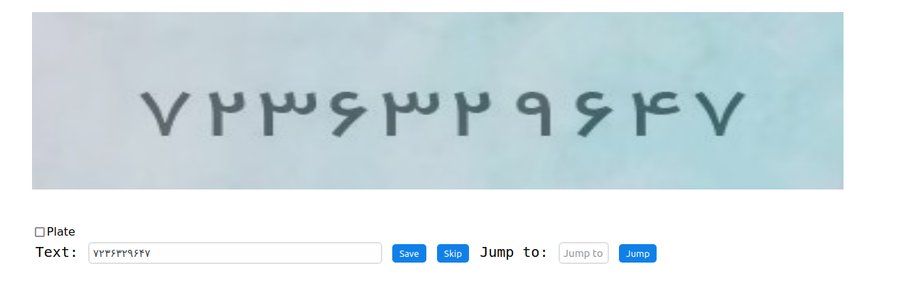

# OCR Labeling Tool

### Introduction
This is a really simple web app to hand label text data for OCR tasks built on Flask and PyQt. 



### Installation
Install the requirements:
```bash
pip install -r requirements.txt
```

### Configs & Settings
The initial configs are located directly in `settings.py` module. The explanation of the hyper-parameters are as follows:
* DATA_FOLDER: The folder which contains the images.
* CURSOR_FILE: The path which the cursor file is generated
* RESULTS_FOLDER: The directory which the results are saved in after being labeled.

### Architecture
First time you run the app a file  called `cursor.json` is created to gather your images
paths and track your progress so that every time you run it you continue where you left off.
(**Note:** Due to my laziness, the cursor module does not track any changes made on disk to 
the source images folder, so one has to manually modify the cursor config file under `images` key or
delete the whole thing!) This file tracks the index to read and all images paths in the source folder.
A sample `cursor.json` file would be like below:
```json
{
  "file_index_to_read": 1,
  "images": {
    "1": "true-soule.jpg",
    "2": "Eskillstuna.jpg",
    "3": "mistitles.jpg",
    "4": "UNLABELED_1.jpg",
    "5": "coochampion.jpg",
    "6": "UNLABELED_2.jpg",
    "7": "UNLABELED_3.jpg",
    "8": "ennomic.jpg",
    "9": "erytrocytosis.jpg",
    "10": "well-scented.jpg"
  }
}
```
- *file_index_to_read*: images are indexed like above. this parameter sets the index to start from when the app is run.
- *images*: index to image paths mapping

When the app is running, the images show up based on the ordering in `cursor.json`. By default, the app considers that your files are named after their text. (Probably by another OCR model like EasyOCR) Then you have three options:
1. Edit or write text you desire in the text box and hit `Save`. The file with the registered text + the index will be saved to the output folder. (If you hit `Save` without changing the default text that comes up, the same text will be registerd as the result)
2. Hit `Skip` to ignore the image and text all together so that nothing is saved to the output folder.
3. Choose a desired index from `cursor.json` and hit `Jump`. if the index is valid the `file_index_to_read` will be changed to that. Use this in case you need to modify a previously registered image to overwrite it. (Make sure to jump to your last index you were at)

### Run 
Simply run the python app:
```bash
$ python app.py
* Serving Flask app "app" (lazy loading)
 * Environment: production
   WARNING: This is a development server. Do not use it in a production deployment.
   Use a production WSGI server instead.
 * Debug mode: off
 * Running on http://127.0.0.1:5000/ (Press CTRL+C to quit)
```
Qt window will popup but if you prefer web apps you can also navigate to http://localhost:5000



Cheers! ✌️🍻️